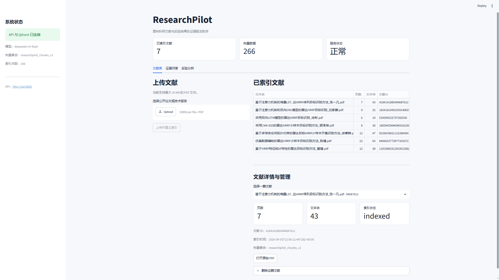
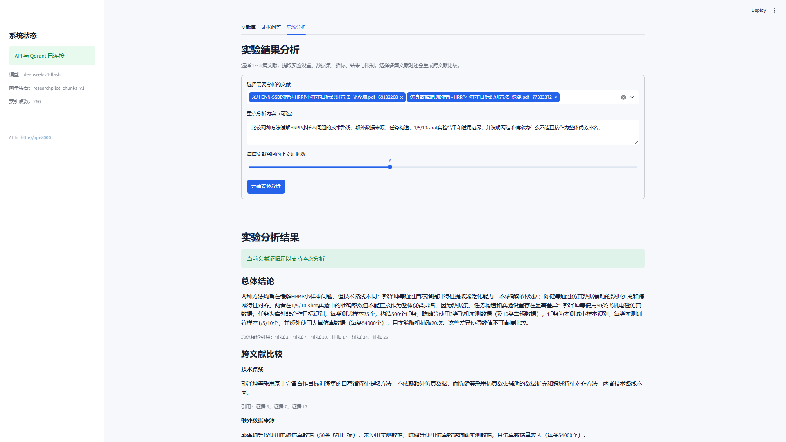
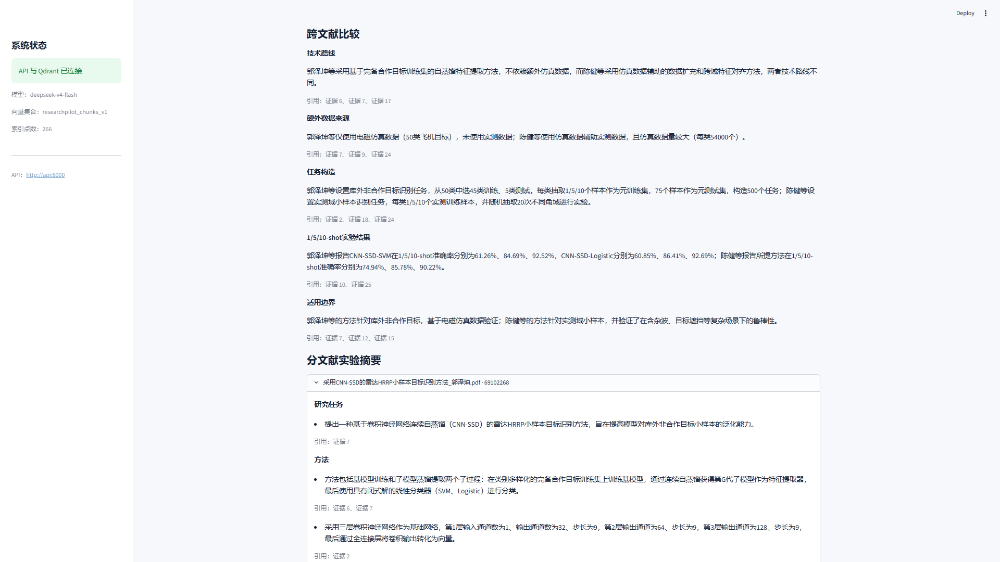
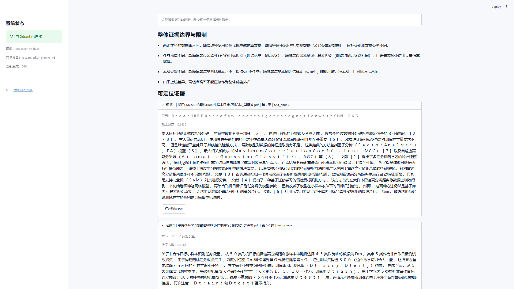
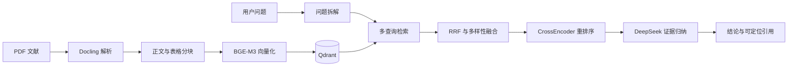

# ResearchPilot

[](https://github.com/khan10969/researchpilot/actions/workflows/ci.yml)


ResearchPilot 是一个面向科研论文与实验结果的证据驱动 Agent
助手。用户上传 PDF 文献后，系统能够完成结构化解析、证据检索、
跨文献比较和实验结果分析，并返回带文献、章节、页码与原文片段
定位的结论。

项目重点解决普通 RAG 在科研场景中的三个问题：

- 跨文献问题容易遗漏部分论文
- 模型容易混淆不同论文的实验条件和指标
- 文献证据不足时容易生成看似合理但无法验证的结论

## 效果预览

### 文献管理与服务状态

支持 PDF 上传、解析、索引、查看和可恢复删除，并显示 API、
向量数据库与索引状态。



### 跨文献证据问答

系统能够限定多篇文献进行检索，比较不同方法的技术路线，
并明确说明实验设置和结果的可比性边界。


### 可定位引用

回答中的结论能够定位到具体文献、章节、页码和证据原文，
并可继续打开原始 PDF 核验。


<details>
<summary>查看更多：证据不足识别与实验分析</summary>

### 证据不足识别

当文献没有包含问题所需实验时，系统会说明缺少的证据，
避免将其他平台或实验条件下的结果直接套用。


### 跨文献实验分析







</details>

## 核心能力

| 能力 | 工程实现 |
|---|---|
| 文献解析 | 使用 Docling 解析 PDF 正文、章节、页码与表格 |
| 语义检索 | 使用 BGE-M3 生成向量并存储到 Qdrant |
| 复杂问题检索 | 问题拆解、多查询召回、RRF 融合与文献多样性控制 |
| 二阶段排序 | 使用 BGE Reranker 对候选证据重新排序 |
| 跨文献比较 | 分文献收集证据，比较方法、数据集、指标、结果和限制 |
| 可定位引用 | 返回文献 ID、章节、页码、文本块与原始 PDF 链接 |
| 证据边界控制 | 区分完全可回答、部分可回答和证据不足问题 |
| 自动化测评 | 24 条案例，结合确定性指标和 LLM Judge |
| 工程可观测性 | 请求 ID、JSON 日志、阶段耗时与 Server-Timing |
| 部署与质量保障 | Docker Compose、pytest、Ruff 和 GitHub Actions |

## 系统流程



## 关键工程设计

### 证据优先的回答流程

系统先完成问题拆解和证据检索，再将经过重排序的证据交给大模型。
回答中的事实通过 evidence ID 与检索结果关联，最后执行引用有效性
检查，降低脱离文献生成结论的风险。

### 跨文献召回与重排序

单次向量搜索容易只召回语义最接近的一篇文献。系统使用多查询检索、
RRF 融合、文献多样性控制和 CrossEncoder 重排序，在相关性与文献
覆盖率之间取得平衡。

### 证据不足保护

系统不只生成答案，还判断现有证据是否足以支持问题。当论文没有报告
指定硬件、数据集或实验条件时，系统会返回限制说明，而不是根据常识
猜测实验结果。

### 双层测评体系

确定性测评检查请求成功率、引用有效率、文献覆盖率、页码召回率和
锚点证据召回率；语义测评使用 LLM Judge 检查标准事实、限制说明和
禁止结论。

### 请求级可观测性

每个 API 请求都有独立请求 ID。系统记录问题规划、证据检索、重排序、
答案生成和实验分析等阶段的结构化 JSON 日志及耗时，便于定位慢请求
和失败阶段。

## 技术栈

- Python 3.12
- FastAPI
- Docling
- Sentence Transformers
- BGE-M3
- BGE Reranker v2 M3
- Qdrant
- DeepSeek API
- Pydantic
- Docker Compose
- pytest、Ruff


## 快速启动

### 1. 创建环境配置

```powershell
Copy-Item .env.example .env
```

编辑 `.env`，至少填写：

```ini
LLM_API_KEY=你的DeepSeek_API_Key
```

使用 GPU 时确认：

```ini
EMBEDDING_DEVICE=cuda
RERANKER_DEVICE=cuda
RERANKER_ENABLED=true
```

### 2. Docker Compose 一键启动

```powershell
docker compose up -d --build
```

首次构建和首次问答需要下载 Python 依赖及本地模型，
可能需要较长时间。

服务地址：

- Web 工作台：http://127.0.0.1:8501
- FastAPI 文档：http://127.0.0.1:8000/docs
- Qdrant Dashboard：http://127.0.0.1:6333/dashboard

查看状态：

```powershell
docker compose ps
```

查看 API 日志：

```powershell
docker compose logs --tail=100 api
```

停止服务：

```powershell
docker compose down
```

不要使用 `docker compose down -v`，除非确认需要删除
Qdrant 数据卷和模型缓存。

### 3. 本地开发模式

仅启动 Qdrant：

```powershell
docker compose up -d qdrant
```

启动 FastAPI：

```powershell
uv run uvicorn researchpilot.api.main:app --reload
```

启动 Streamlit：

```powershell
uv run --extra web streamlit run apps/web/app.py
```

## 主要接口

| 方法 | 路径 | 功能 |
|---|---|---|
| GET | `/api/v1/health` | 检查 API 和 Qdrant |
| POST | `/api/v1/documents/upload` | 上传并索引 PDF |
| GET | `/api/v1/documents` | 获取文献列表 |
| GET | `/api/v1/documents/{id}` | 获取文献详情 |
| GET | `/api/v1/documents/{id}/source` | 查看原始 PDF |
| GET | `/api/v1/documents/{id}/tables` | 获取结构化表格 |
| POST | `/api/v1/qa/ask` | 基于文献证据问答 |
| POST | `/api/v1/analysis/experiments` | 分析和比较实验结果 |

## 测试

运行单元测试：

```powershell
uv run pytest tests/unit -q
```

运行 Qdrant 集成测试前，需要先启动 Docker：

```powershell
uv run pytest tests/integration -q
```

运行代码检查：

```powershell
uv run ruff check .
```

## 测评

项目包含24条初版测评案例，覆盖：

- 单篇文献问答
- 跨文献方法比较
- 数值与表格检索
- 部分可回答问题
- 证据不足问题
- 实验结果分析

运行完整确定性测评：

```powershell
uv run python scripts/run_evals.py `
  --suite all `
  --qa-top-k 10 `
  --analysis-top-k 8 `
  --timeout 300
```

运行语义测评：

```powershell
uv run python scripts/judge_eval_run.py `
  --run-dir evals/runs/<运行编号>
```

语义测评会调用大模型 API，可能产生费用。

## 测评结果

当前测评集包含 24 条案例，覆盖单篇问答、跨文献比较、表格数值检索、
部分可回答和证据不足等场景。以下结果来自固定的本地六篇 HRRP
论文语料及 v0.4 检索配置。

| 指标 | 结果 |
|---|---:|
| 请求成功率 | 1.0000 |
| 确定性通过率 | 0.9583 |
| 引用有效率 | 1.0000 |
| 文献覆盖率 | 1.0000 |
| 证据页召回率 | 1.0000 |
| 锚点证据召回率 | 0.9833 |
| 语义通过率 | 0.9167 |
| 标准事实覆盖率 | 0.9595 |
| 限制说明覆盖率 | 1.0000 |
| 禁止结论安全率 | 1.0000 |
| 平均延迟 | 7507.95 ms |
| P95 延迟 | 14229.91 ms |

详细设计决策见：

```text
docs/adr/0001-cross-document-reranking.md
```

完整基线报告：

- [确定性测评报告](evals/baselines/v0.4-multi-query-reranker/report.md)
- [语义测评报告](evals/baselines/v0.4-multi-query-reranker/semantic_report.md)

上述结果用于验证当前语料和测评集上的系统行为，不代表系统已经覆盖
所有科研领域或所有 PDF 排版形式。

## 已知限制

- 当前测评语料集中在 HRRP 目标识别领域，领域覆盖仍然有限
- 复杂扫描版 PDF、公式和跨页表格的解析效果依赖 Docling
- 当前采用本地单节点部署，尚未实现多用户权限和任务隔离
- 首次启动需要下载嵌入和重排序模型，耗时受网络环境影响
- 回答生成依赖外部大模型 API，结果、延迟和成本可能随模型变化

## 后续计划

- 将 PDF 解析和索引改造成异步后台任务
- 支持流式回答和文献处理进度展示
- 增加问答历史、用户反馈与失败案例回流
- 扩展更多学科文献和更大规模的评测集
- 增加权限控制、任务队列和生产级监控

## 数据说明

仓库不提交第三方论文全文、解析产物、向量数据库和 API Key。

完整测评集依赖本地导入的6篇 HRRP 研究论文。案例定义保存在
`evals/`，论文文件需要使用者自行准备并导入。