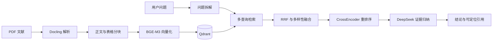

# ResearchPilot

ResearchPilot 是一个面向科研文献与实验结果的证据驱动 Agent
助手。用户导入 PDF 文献后，系统能够完成文献解析、证据检索、
跨文献比较和实验结果分析，并返回带页码及来源定位的结论。

## 核心能力

- PDF 上传、解析、分块和向量索引
- 表格识别与结构化实验数据提取
- 基于 BGE-M3 和 Qdrant 的语义检索
- 复杂问题拆解、多查询检索和 RRF 融合
- CrossEncoder 二阶段重排序
- 跨文献比较与证据不足识别
- 带文献、章节、页码和文本块定位的引用
- 确定性指标与 LLM Judge 双层测评

## 系统流程



## 技术栈

- Python 3.12
- FastAPI
- Docling
- Sentence Transformers
- BGE-M3
- BGE Reranker v2 M3
- Qdrant
- DeepSeek API
- Pydantic
- Docker Compose
- pytest、Ruff


## 快速启动

### 1. 创建环境配置

```powershell
Copy-Item .env.example .env
```

编辑 `.env`，至少填写：

```ini
LLM_API_KEY=你的DeepSeek_API_Key
```

使用 GPU 时确认：

```ini
EMBEDDING_DEVICE=cuda
RERANKER_DEVICE=cuda
RERANKER_ENABLED=true
```

### 2. Docker Compose 一键启动

```powershell
docker compose up -d --build
```

首次构建和首次问答需要下载 Python 依赖及本地模型，
可能需要较长时间。

服务地址：

- Web 工作台：http://127.0.0.1:8501
- FastAPI 文档：http://127.0.0.1:8000/docs
- Qdrant Dashboard：http://127.0.0.1:6333/dashboard

查看状态：

```powershell
docker compose ps
```

查看 API 日志：

```powershell
docker compose logs --tail=100 api
```

停止服务：

```powershell
docker compose down
```

不要使用 `docker compose down -v`，除非确认需要删除
Qdrant 数据卷和模型缓存。

### 3. 本地开发模式

仅启动 Qdrant：

```powershell
docker compose up -d qdrant
```

启动 FastAPI：

```powershell
uv run uvicorn researchpilot.api.main:app --reload
```

启动 Streamlit：

```powershell
uv run --extra web streamlit run apps/web/app.py
```

## 主要接口

| 方法 | 路径 | 功能 |
|---|---|---|
| GET | `/api/v1/health` | 检查 API 和 Qdrant |
| POST | `/api/v1/documents/upload` | 上传并索引 PDF |
| GET | `/api/v1/documents` | 获取文献列表 |
| GET | `/api/v1/documents/{id}` | 获取文献详情 |
| GET | `/api/v1/documents/{id}/source` | 查看原始 PDF |
| GET | `/api/v1/documents/{id}/tables` | 获取结构化表格 |
| POST | `/api/v1/qa/ask` | 基于文献证据问答 |
| POST | `/api/v1/analysis/experiments` | 分析和比较实验结果 |

## 测试

运行单元测试：

```powershell
uv run pytest tests/unit -q
```

运行 Qdrant 集成测试前，需要先启动 Docker：

```powershell
uv run pytest tests/integration -q
```

运行代码检查：

```powershell
uv run ruff check .
```

## 测评

项目包含24条初版测评案例，覆盖：

- 单篇文献问答
- 跨文献方法比较
- 数值与表格检索
- 部分可回答问题
- 证据不足问题
- 实验结果分析

运行完整确定性测评：

```powershell
uv run python scripts/run_evals.py `
  --suite all `
  --qa-top-k 10 `
  --analysis-top-k 8 `
  --timeout 300
```

运行语义测评：

```powershell
uv run python scripts/judge_eval_run.py `
  --run-dir evals/runs/<运行编号>
```

语义测评会调用大模型 API，可能产生费用。

## v0.4 测评结果

| 指标 | 结果 |
|---|---:|
| 请求成功率 | 1.0000 |
| 确定性通过率 | 0.9583 |
| 引用有效率 | 1.0000 |
| 文献覆盖率 | 1.0000 |
| 证据页召回率 | 1.0000 |
| 锚点证据召回率 | 0.9833 |
| 语义通过率 | 0.9167 |
| 标准事实覆盖率 | 0.9595 |
| 限制说明覆盖率 | 1.0000 |
| 禁止结论安全率 | 1.0000 |
| 平均延迟 | 7507.95 ms |
| P95 延迟 | 14229.91 ms |

详细设计决策见：

```text
docs/adr/0001-cross-document-reranking.md
```

## 数据说明

仓库不提交第三方论文全文、解析产物、向量数据库和 API Key。

完整测评集依赖本地导入的6篇 HRRP 研究论文。案例定义保存在
`evals/`，论文文件需要使用者自行准备并导入。